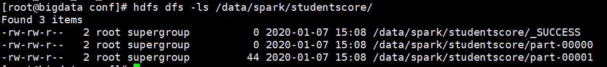
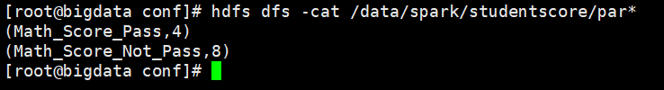
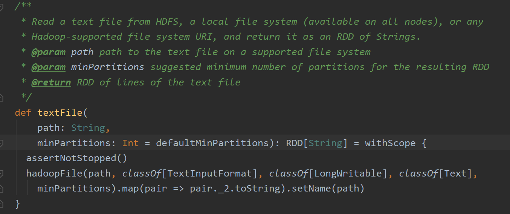
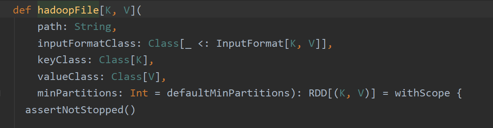
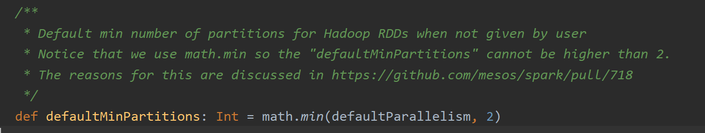

# spark-training
一个大数据的例子-SPARK实现 （简书链接：https://www.jianshu.com/p/8d9efad41053）

## 3.使用Spark解决
spark源码是由scala语言进行编码的，Spark任务是使用scala语言进行编写，
没有scala语言基础的同学，需要对scala有一定的了解，才能更好的完成。
### 3.1 编写
```
def main(args: Array[String]): Unit = { 
    val spark = SparkSession
    .builder()    
    .appName("Spark Student Score")    
    .master("local[2]")    
    .getOrCreate()  
    
    val outKeyPass = "Math_Score_Pass";  
    val outKeyNotPass = "Math_Score_Not_Pass";  
    
    val sc :SparkContext = spark.sparkContext  val lines = sc.textFile(args(0))  
    // 数据格式： 200412169,gavin,male,30,0401,math=24&en=60&c=85&os=78,math=22&en=20&c=85&os=78   
    val studentScoreCount = lines    
        .map(_.split(","))    
        .filter(_.length == 7)    
        .map(t => t(5))    
        .map(_.split("&"))    
        .filter(_.length == 4)    
        .map(t => t(0))    
        .map(_.split("="))    
        .filter(_.length ==2)    
        .map(t => if (t(1).toInt >= 60) (outKeyPass,1) else (outKeyNotPass,1) )    
        .reduceByKey(_+_)    
        .saveAsTextFile(args(1))
 }
```

使用RDD的方式，执行思路与Hadoop的思路基本一致。使用逗号分割获取第一学期的成绩，使用&分割，获取数学成绩，判断数据成绩是否大于等于60，如果满足，则生成（"Math_Score_Pass"，1），否则，生成（"Math_Score_Not_Pass",1），然后使用reduceByKey将所有的结果进行累加，最后保存到HDFS的指定目录。

### 3.2 执行
```
    spark-submit \
    --master local \
    --class com.spark.StudentScore \
    original-spark-training-1.0-SNAPSHOT.jar \
    /data/student /data/spark/studentscore/
```
### 3.3 查看执行结果
查看 hdfs结果结果目录：:
```
    hdfs dfs -ls /data/spark/studentscore/
```


查看HDFS结果内容：
```
    hdfs dfs -cat /data/spark/studentscore/par*
```


在结果目录中，发现产生了2个part-0000* 的文件，我们要看一下 具体是什么原因产生的：
查阅相关资料，发现从hdfs中读取文件，源码默认的分区数是2，分区数决定最终的结果
>在默认的textfile中，如果从hdfs中读取文件，源码中默认的分区数是2，如果想改变分区数，可以在textfile中设置第二个参数“分区数”

查看textFile源码



查看hadoopFile源码


其中defaultMinPartitions为定义的默认分区数：


### 3.4 参考文献
[1]. [spark中saveAsTextFile如何最终生成一个文件](https://blog.csdn.net/qq_26803795/article/details/81543008)